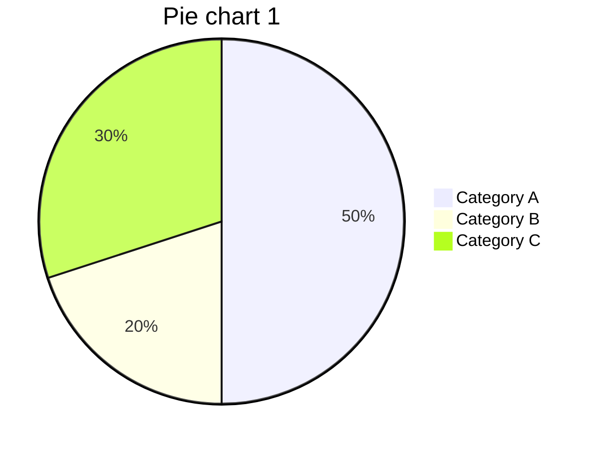

# Characterisation Service

This repository contains the [ArangoDB](https://www.arangodb.com) [Foxx micro service](https://www.arangodb.com/docs/stable/foxx.html) to manage and use characterisation data and datasets.

## Installation

1. You must first either install [ArangoDB](https://www.arangodb.com), or have an existing database available.
2. *Create* or *select* an existing *database*.
3. In the `Services` *left tab* press the `+ Add service` button.
4. Select the `GitHub` *top tab*, set the `Repository*` field to **skofic/characterisation-database-service** and the `Version*` field to **main**; press the `Install` button.
5. An alert will be presented requesting the `Mount point` for the service, you can provide *any suitable value*. If you already have the collections, analysers and views you can uncheck the `Run setup?` checkbox, if you are starting on a new database ensure `Run setup?` is checked. Press the `Install` button.

At this point the service will create the necessary *collections*, *analysers* and *views* if not already there.

You will see that in the `Services` *left tab* there is a *top tab* called `Settings`: this can be used to *customise* the general *settings*:

- `data_coll_name`: The data collection name.
- `data_view_name`: The data view name.
- `dataset_coll_name`: The datasets collection name.
- `dataset_view_name`: The datasets view name.

You can adjust these settings if needed, but it is advised to do so on a new database:

1. Install the service on a new database, do not check `Run setup?`.
2. Make changes to the settings.
3. In the top menu of the `Services` left tab pane press the `</>` symbol and select the `Setup` dropdown option, this will create all the required database resources using the updated settings.

Note that these services *require* the *data dictionary* to be installed in the same database, see **[THIS](https://github.com/skofic/data-dictionary-service/blob/main/README.md)**.

## Database

This set of services expects the collections that are created during the setup phase:

- `data_coll_name`: This collection contains the characterisation data. Characterisation data data records contain all their data at the top level, both the data values and the data references such as the related dataset, condervation unit, species and date.
- `data_view_name`: This is the data view. The data collection has no indexes, these are provided by the view.
- `dataset_coll_name`: This collection contains the datasets metadata. A dataset is a collection of data values that follow the same protocol, share the same data dictionary and that was submitted by a known provider in a known date. Records in this collection contain summary data covering the data records that belong to the current dataset. All data records must belong to a dataset.
- `dataset_view_name`: This is the datasets view. The datasets collection has no indexes, these are provided by the view.

## Services

The services are divided into two sections: one section handling *data*, and the other covering the *datasets* to which the data belongs to.

### Dataset

This set of services can be used to *query*, *summarise* and *update* datasets.

#### Query

Use this service to query the datasets using a set of criteria.

The service expects the chaining operator, `op`, as a query path parameter, it determines how the criteria is chained: `AND` to expect *all criteria* to be true, `OR` to expect *at least one criteria* to pass the tests. The selection criteria is provided in the request body:

- `_key`: Match a list of dataset primary keys.
- `std_project`: Match a list of project codes.
- `std_dataset`: Match dataset project codes using a wildcard search string. The supported wildcards are `_` to match a single arbitrary character, and `%` to match any number of arbitrary characters. Literal `%` and `_` need to be escaped with a backslash. Backslashes need to be escaped themselves.
- `std_date`: Match datasets whose `std_date_start` and `std_date_end` are within the date range expressed by the provided object `std_date_start` and `std_date_end` properties.
- `std_date_submission`: Match datasets whose submission date is within the `min` and `max` time interval.
- `_title`: Provide space delimited keywords to search dataset title.
- `_description`: Provide space delimited keywords to search dataset description.
- `_citation`: Provide space delimited keywords to search dataset citations.
- `count`: Provide a `min` and `max` range to select datasets whose data record count lies in the interval.
- `_subject`: Match a list of `_subject` *category codes*. Subjects are category codes associated to descriptors belonging to the dataset data collection.
- `_classes`: Provide a list of _class category codes, set the `doAll` property value to `true` in order to require *all elements* to be *matched*; if `false`, *any element* can *match*. Classes are category codes associated to descriptors belonging to the dataset data collection.
- `_domain`: Provide a list of `_domain` category codes, set the `doAll` property value to `true` in order to require *all elements* to be *matched*; if `false`, *any element* can *match*. Domains are category codes associated to descriptors belonging to the dataset data collection.
- `_tag`: Provide a list of `_tag` category codes, set the `doAll` property value to `true` in order to require *all elements* to be *matched*; if `false`, *any element* can *match*. Tags are category codes associated to descriptors belonging to the dataset data collection.
- `species_list`: Provide space delimited keywords to search scientific names used in data.
- `std_terms`: Provide a list of descriptor names used in the dataset data. Set the `doAll` property value to `true` in order to require *all elements* to be *matched*; if `false`, *any element* can *match*.
- `std_terms_quant`: Provide a list of quantitative descriptor names used in the dataset data. Set the `doAll` property value to `true` in order to require *all elements* to be *matched*; if `false`, *any element* can *match*.
- `std_terms_key`: Provide a list of dataset *key* fields, set the `doAll` property value to `true` in order to require *all elements* to be *matched*; if `false`, *any element* can *match*. Key fields represent the combination of fields that make a data record unique.
- `std_terms_summary`: Provide a list of dataset *summary* fields, set the `doAll` property value to `true` in order to require *all elements* to be *matched*; if `false`, *any element* can *match*. Summary fields are those fields that can be *summarised* as *average*, *maximum*, *etc*.

The service will return:

- `200`: If *successful*, the service will return the full dataset record matching the search criteria.
- `500`: *Any error*.

#### Summary

Use this service to retrieve the list of summary data associated to a specific dataset.

The service expects the dataset primary key, `key`, as a query path parameter. If the dataset is matched, the service will return the summary of all data belonging to the dataset for the following fields:

- `count`: Number of data records.
- `std_date_start`: Date range start.
- `std_date_end`: Date range end.
- `_subject`: List of `_subject` categories featured in the data descriptors.
- `_subject`: List of `_subject` categories featured in the data descriptors.
- `_classes`: List of `_class` categories featured in the data descriptors.
- `_domain`: List of `_subject` categories featured in the data descriptors.
- `_tag`: List of `_tag` categories featured in the data descriptors.
- `species_list`: List of featured scientific names featured in data.
- `std_terms`: List of descriptors featured in data.
- `std_terms_quant`: List of quantitative descriptors featured in data.

*This service will dynamically query the data records belonging to the dataset, none of the corresponding fields stored in the dataset record will be returned.* Use this service to get up to date data statistics.

The service will return:

- `200`: If *successful*, the service will return the full dataset record matching the search criteria.
- `500`: *Any error*.

#### Update

Use this service to update statistics of a dataset.

The service expects a list of dataset primary keys in the request body, the service will update the statistics fields for all matched datasets.

*This service will dynamically query the data records belonging to the dataset*. See the `Summary` service for the list of involved descriptors.

The service will return:

- `200`: If *successful*, the service will return the matched full dataset records.
- `500`: *Any error*.

### Data

This set of services can be used to *scan*, *summarise* and *query* data belonging to datasets.

#### Scan

Use this service to scan data records belonging to a specific dataset.

The service expects the dataset primary key, `dataset`, the query starty element, `start`, and the number of records to return, `limit`, as a query path parameters.

The service can be used to iterate a dataset's data using paging; the data is returned in an undefined order.

The service will return:

- `200`: If *successful*, the service will return the data page.
- `500`: *Any error*.

#### Summary

Use this service to retrieve statistics for a descriptor belonging to the data of a dataset.

The service expects the dataset primary key, `dataset`, the statistical function to apply, `stat`, and the primary key of the descriptor to be summarised, `summary`, as a query path parameters.

The available statistical functions, provided in `stat`, are:

- `MIN`: minimum.
- `MAX`: maximum.
- `AVG`: average.
- `MEDIAN`: median.
- `STDDEV`: standard deviation.
- `VARIANCE`: variance.

The `summary` parameter should be a data descriptor belonging to the *summary fields* of the *dataset*, `std_terms_summary`, if that is not the case, the service will return an error.

The service will return:

- `200`: If *successful*, the service will return the data page.
- `400`: Provided descriptor does not belong to dataset summary fields.
- `500`: *Any error*.

#### Query

Use this service to query data records belonging to a specific dataset.

The service expects the following query path parameters:

- `dataset`: The primary key of the related dataset.
- `op`: Selection criteria chaining operator:
    - `AND`: All criteria must match.
    - `OR`: Any criteria may match.
- `start`: Selection start element.
- `limit`: Number of records to return.

The selection criteria can be provided in the request body:

- `gcu_id_number`: Conservation unit number, provide a wildcard search string. The supported wildcards are `_` to match a single arbitrary character, and `%` to match any number of arbitrary characters. Literal `%` and `_` need to be escaped with a backslash. Backslashes need to be escaped themselves.
- `std_date`: Data measurement date range, provide start and end dates.
- `species`: Provide space delimited keywords to search scientific names.
- `chr_tree_code`: Provide a list of tree codes.

The service will return:

- `200`: If *successful*, the service will return the data page.
- `500`: *Any error*.

## License

Copyright (c) 2023 Milko Skofic

License: Apache 2

